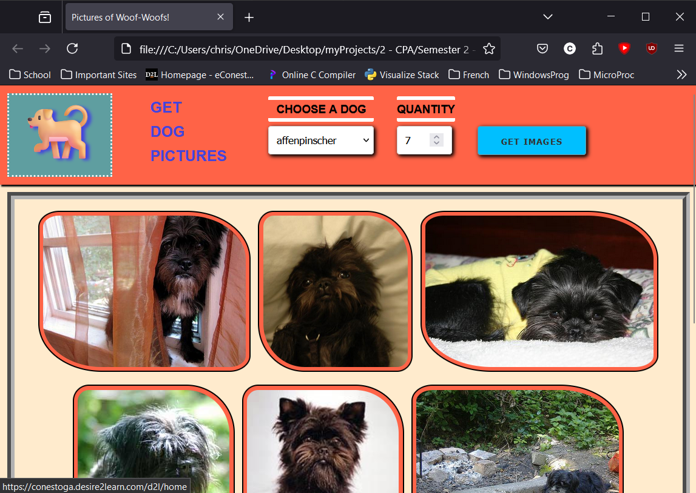

# Pictures of Woof Woofs!

I made this for an assignment to better understand API calls and using ASYNC in JavaScript.

It's nothing mind blowing, but it was my first time calling an API and loading items on a web page using Async.

The json data is pulled from https://dog.ceo/api/breeds/list/all.

[Click here to the view website without downloading it](https://htmlpreview.github.io/?https://github.com/chriswickens/picturesOfWoofWoofs/blob/main/index.html)

Note: The site can be a little slow when making a request to get the list of dogs, please give it a moment to load. (Sometimes refreshing works)

